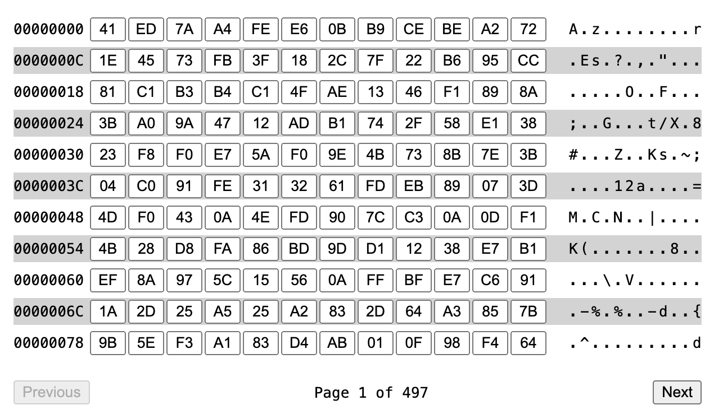

# Ngx Hex Editor

[](https://www.npmjs.com/package/ngx-hex-editor)  
[](./LICENSE)

A simple and lightweight Hex Editor component for Angular applications. This library allows you to display and edit
binary data efficiently, with features such as editable hex values and UTF8 visualization.

<p align="center">
  
</p>

---

## Features

- **Hex and UTF8 Views**: Displays data in both hexadecimal and UTF8 formats.
- **Editable Data**: Supports modifying individual bytes interactively in place.
- **Pagination**: Allows to efficiently edit big byte arrays.
- **Responsive**: Works well across various screen sizes.

---

## Installation

Install the package using npm or yarn:

```bash  
npm install ngx-hex-editor  
```  

or

```bash  
yarn add ngx-hex-editor  
```  

---

## Usage

1. Import the module in your Angular application:

```typescript  
// app.module.ts  
import { NgModule } from '@angular/core';
import { BrowserModule } from '@angular/platform-browser';
import { HexEditorModule } from 'ngx-hex-editor';

@NgModule({
  declarations: [
    AppComponent
  ],
  imports: [
    BrowserModule,
    HexEditorModule
  ],
  bootstrap: [AppComponent]
})
export class AppModule {
}  
```  

2. Use the component in your template:

```html  

<hex-editor
  [data]="data"
  (dataChange)="handleDataChange()">
</hex-editor>  
```  

3. Bind data and handle events in your component:

```typescript  
import { Component } from '@angular/core';

@Component({
  selector: 'app-root',
  templateUrl: './app.component.html',
  styleUrls: ['./app.component.css']
})
export class AppComponent {
  data = new Uint8Array([0x48, 0x65, 0x6C, 0x6C, 0x6F]);

  handleDataChange() {
    console.log('Data updated:', this.data);
  }

}  
```  

---

## Options

| Input         | Type         | Default            | Description                                               |  
|---------------|--------------|--------------------|-----------------------------------------------------------|  
| `data`        | `Uint8Array` | `new Uint8Array()` | Binary data to display/edit.                              |  
| `readOnly`    | `boolean`    | `false`            | If `true`, editing is disabled.                           |  
| `maxRows`     | `number`     | `0`                | Max amount of rows in the viewport. 0 means unlimited.    |  
| `maxColumns`  | `number`     | `0`                | Max amount of columns in the viewport. 0 means unlimited. |  
| `showOffsets` | `boolean`    | `true`             | Show global offset for each line (left panel).            |  
| `showUtf8`    | `boolean`    | `true`             | Show UTF8 representation for each byte (right panel).     |  

| Output       | Type                       | Description                                                                                                                         |  
|--------------|----------------------------|-------------------------------------------------------------------------------------------------------------------------------------|  
| `dataChange` | `EventEmitter<Uint8Array>` | Emits updated data when changes occur. Note: editor edits data in place, so returned value has the same reference as provided data. |

---

## Contributing

Contributions are welcome! Please open an issue or submit a pull request
on [GitHub](https://github.com/AndyGura/ngx-hex-editor).

---


## License
[Apache License](LICENSE)
